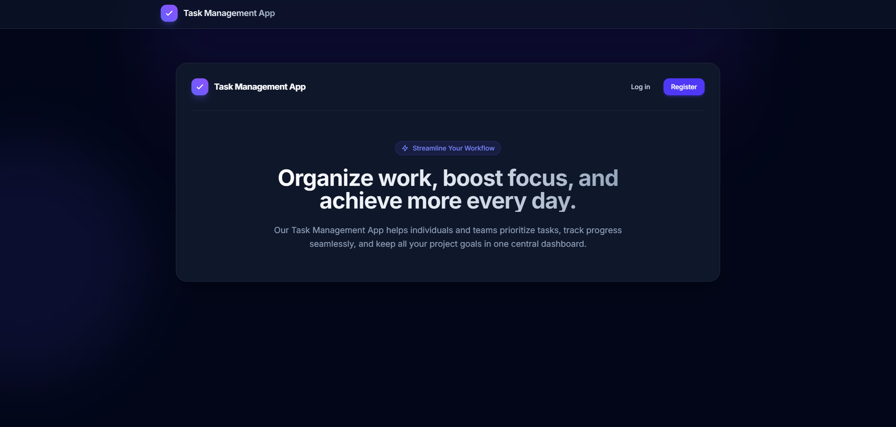
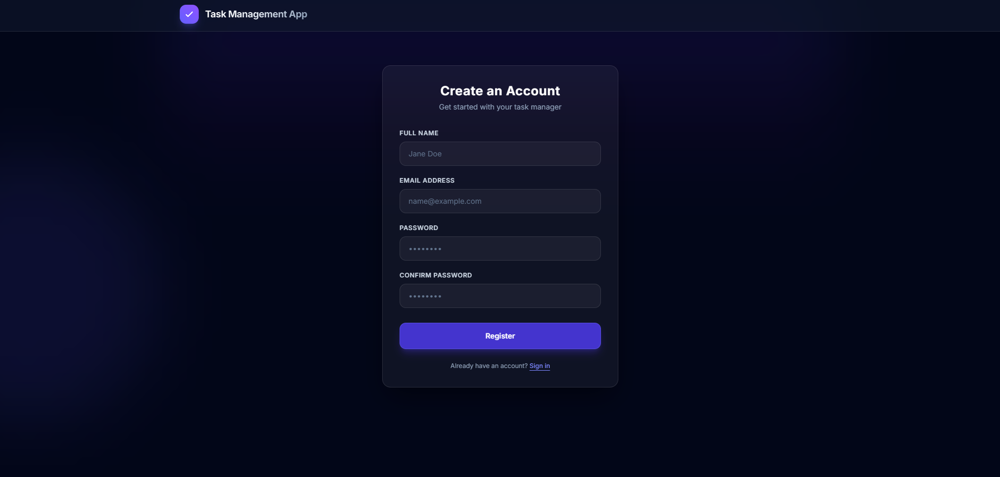
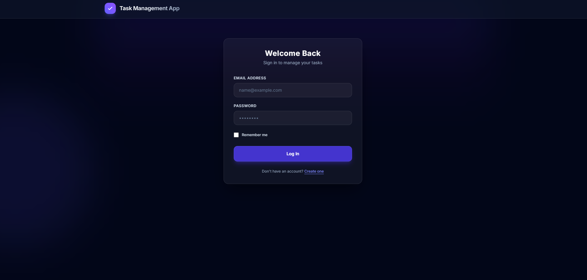
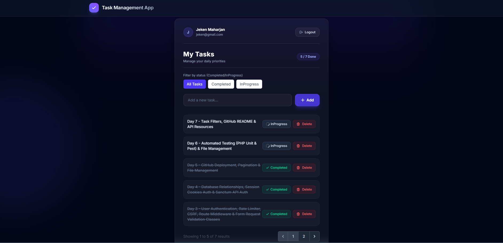

# TASK MANAGEMENT APPLICATION

A workflow and task management system designed to add tasks, track tasks progress and manage the tasks.

---

## Overview

**Task Management App** helps individuals to organize daily workflows and tasks and ensures tasks complete on time.

### Key Features

* **Authentication :** With proper Authentication, User can Register and Signin their account. 
* **Tasks List :** User can view their tasks list with status(*Completed* & *InProgress*).
* **Add Task :** User can add their tasks.
* **Delete Task :** User can delete their tasks.
* **Update Task :** User can toggle update their tasks between *Completed* & *InProgress*.

---

## Preview

<p align="center">
  
</p>

<p align="center">
  
</p>

<p align="center">
  
</p>

<p align="center">
  
</p>

---

## Tech Stack

* **Frontend :** Laravel Blade, Tailwind CSS
* **Backend :** PHP 8.5.9 / Laravel 13.x
* **Database :** Laravel SQLite
* **Authentication :** Laravel Web Sessions & Laravel Sanctum (API Tokens)
* **Build Tool :** Vite
* **Icons :** Blade Icons / Hero Icons
* **Fonts :** Google Fonts

---

## Getting Started

### Prerequisites

Ensure you have the following installed locally:

* **PHP :** 8.2 or higher
* **Composer :** 2.x or latest
* **Node.js & NPM :** 18.x or higher
* **Laravel Herd:** 1.30.0 or latest
* **Git:** Latest

### Installation & Setup

1. Clone Repository: Open your terminal and clone the repository.
    ```bash
    git clone <repository-url>
    ```
    > Replace with the GitHub repository URL.
    
2. Install PHP Dependencies. Download all backend dependencies defined in composer.json:
    ```bash
    cd task-management-app
    composer install
    ```

3. Install frontend dependencies & Start the Client side(Frontend):
    ```bash
    npm install
    npm run dev
    ```

4. Configure Database & Run Migrations
    ```bash
    php artisan migrate
    ```

5. Start the Server side(Backend):
    ```bash
    php artisan serve
    ```

---

## Development Phases & Progress

The development of Task Management App is organized into structured phases to ensure scalability, maintainability and incremental delivery of features.

### Phase 1 - Core Funtionality

### Phase 2 - Advanced Features

### Future Enhancements

---

## Contributing

Contributions are welcome and appreciated. To maintain code quality and consistency, please follow the steps below:

1. **Fork the Repository**  
    Click the Fork button on GitHub to create your own copy of the repository.

2. **Clone Your Fork**  
    ```bash
    git clone https://github.com/JekenMaharjan/Task-Management-Application.git
    cd task-management-app
    ```

3. **Create a Feature Branch**  
    Always create a new branch from main for your feature or fix:
    ```bash
    git checkout -b feature/your-feature-name
    ```

4. **Make Your Changes**  
    Follow the existing project structure and coding conventions.

5. **Commit Your Changes**  
    Write meaningful commit messages:
    ```bash
    git commit -m "message..."
    ```

6. **Push to Your Branch**  
    ```bash
    git push origin feature/your-feature-name
    ```

7. **Open a Pull Request**  
    Go to the original repository and open a Pull Request.  
    Provide a clear description of:  
    - What you implemented
    - Why it was needed
    - Any screenshots (if UI changes)

---

## License

This project is licensed under the [MIT License](https://choosealicense.com/licenses/mit/).

---

## Contact

For any inquiries, reach out to us at:
- **Email:** [JekenMaharjan](maharjanjeken@gmail.com)
- **Github:** [Jekode](https://github.com/JekenMaharjan)

---

## Connect with Me

> Email: [maharjanjeken@gmail.com](mailto:maharjanjeken@gmail.com)

> Portfolio: [**jekenmaharjan.com.np**](https://jekenmaharjan.com.np)

> [](https://www.linkedin.com/in/jekenmaharjan/)  [](https://github.com/JekenMaharjan)  [](https://x.com/JekenMaharjan)  [](https://linktr.ee/JekenMaharjan)